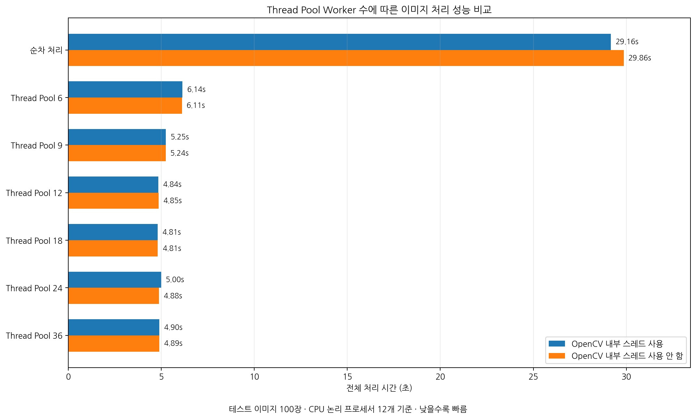
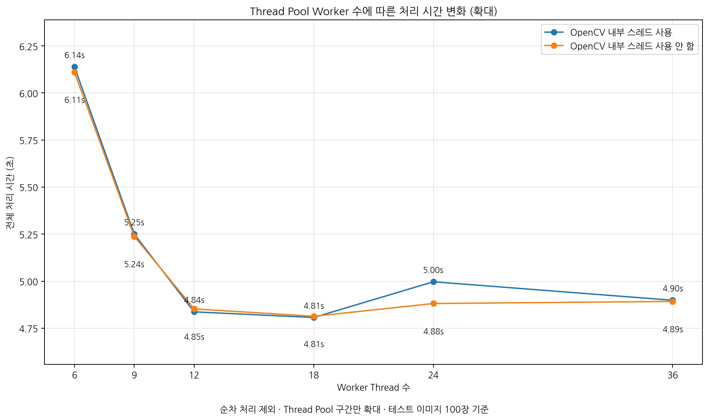

# MFC OpenCV Thread Pool Image Processing Application

<p align="center">
  
</p>

<p align="center">
  MFC 기반 영상 전처리 및 스레드풀 병렬 처리 성능 비교 프로그램
</p>

## 프로젝트 소개

Windows MFC와 스레드풀(Thread Pool)을 기반으로 구현한 영상 처리 데모 프로그램입니다.

UI는 MFC를 기반으로 구성했으며, 기본 컨트롤을 상속한 커스텀 컨트롤을 적용했습니다. 고정 크기의 스레드풀을 구현하고 다수의 이미지 처리 작업을 작업 큐(Task Queue)에 등록하여 워커 스레드에서 병렬로 처리할 수 있도록 구성했습니다.

OpenCV를 이용하여 입력 이미지에 노이즈 및 그림자 제거, 대비 및 밝기 보정, 문서 경계와 모서리 검출, 기울기 보정, 이진화 등의 전처리를 수행합니다. 이를 통해 문서 이미지의 가독성을 높이고 후속 인식 처리에 적합한 형태로 보정합니다.

이미지 처리 작업은 UI 스레드와 분리된 워커 스레드에서 수행하며, 워커 스레드가 MFC UI 컨트롤에 직접 접근하지 않도록 Windows Message 기반의 구조를 사용했습니다.

이를 통해 영상 처리 중에도 UI 응답성을 유지하면서 작업 시작, 진행, 완료 상태와 처리 결과를 안전하게 UI 스레드에 전달하도록 구성했습니다.

처리가 완료되면 결과 영상을 화면에서 바로 확인할 수 있으며, 성능 분석을 위해 각 작업의 처리 시간 측정 결과를 로그 파일로 저장할 수 있습니다.

또한 작업 특성과 실행 환경에 적합한 병렬화 수준을 확인할 수 있도록 다음 조건에 따른 처리 성능을 비교할 수 있게 구성했습니다.

* 순차 처리와 스레드풀 기반 병렬 처리 비교
* 스레드풀의 워커 스레드 수에 따른 처리 성능 변화
* OpenCV 내부 스레드와 워커 스레드 간 자원 경합에 따른 성능 변화

## 주요 기능

### 영상 처리

* OpenCV 기반 이미지 전처리
* CLAHE 기반 국부 대비 보정
* 노이즈 및 그림자 제거
* 경계선 검출
* 문서 모서리 검출
* 원근 및 기울기 보정
* 적응형 이진화 및 문자 경계 강조

### 멀티스레드 처리

* 스레드풀 기반 병렬 작업 처리
* 작업 큐 기반 작업 등록 및 분배
* 워커 스레드를 통한 다중 이미지 병렬 처리
* 스레드풀과 독립적으로 동작하는 싱글 스레드 지원
* 스레드풀 실행 상태 및 종료 제어

### MFC UI

* MFC Dialog 기반 사용자 인터페이스
* 기본 컨트롤 상속을 이용한 커스텀 UI 컨트롤
* Windows Message 기반 워커 스레드 / UI 스레드 통신
* 워커 스레드의 UI 컨트롤 직접 접근 방지
* 영상 처리 중 UI 응답성 유지
* 처리 결과 영상 확인
* 작업 시간 로그 출력 및 파일 저장

### 성능 테스트

* 순차 처리와 스레드풀 기반 병렬 처리 시간 비교
* 워커 스레드 수 변경에 따른 처리 성능 비교
* OpenCV 내부 스레드와 스레드풀 워커 스레드 간 자원 경합 영향 측정
* 작업별 처리 시간 측정 및 로그 기록

## 프로그램 구조

### 스레드풀 구조

작업 요청마다 새로운 스레드를 생성하지 않고, 미리 생성한 워커 스레드를 재사용하는 고정 크기 스레드풀을 구현했습니다.

이미지 처리 작업은 작업 큐에 등록되며, 대기 중인 워커 스레드는 `std::condition_variable`을 통해 새로운 작업을 전달받아 처리합니다.

```text
AddTask()
    │
    ▼
Task Queue
    │
    │ notify_one()
    ▼
Worker Thread
    │
    ▼
Image Processing
```

이를 통해 반복적인 스레드 생성 비용을 줄이고, 다수의 이미지 처리 작업을 병렬로 수행하도록 구성했습니다.

Thread Pool과 별도로 하나의 독립적인 작업을 실행할 수 있는 Single Thread도 지원하며, Thread Pool 작업과 Single Thread 작업을 독립적으로 관리합니다.

### UI 스레드 연동

영상 처리를 담당하는 워커 스레드는 MFC 컨트롤에 직접 접근하지 않고 `PostMessage()`를 이용해 작업 상태와 결과를 UI 스레드에 전달합니다.

```text
Worker Thread
     │
     │ PostMessage()
     ▼
Windows Message Queue
     │
     ▼
UI Thread
     │
     ▼
MFC Control Update
```

이를 통해 영상 처리 중에도 UI 응답성을 유지하고, 작업 진행 상태와 결과를 UI 스레드에서 안전하게 갱신하도록 구성했습니다.

## 테스트 

## 프로그램 사용

1. `ImgProcAmp.exe`를 실행합니다.
2. 처리할 이미지가 포함된 폴더를 선택합니다.
3. 순차 처리 또는 스레드풀 처리 방식을 선택합니다.
4. 스레드풀 사용 시 워커 스레드 수와 OpenCV 내부 스레드 사용 여부를 설정합니다.
5. 이미지 처리 작업을 실행합니다.
6. 처리 결과와 작업 시간을 프로그램 화면에서 확인합니다.
7. 이미지 리스트를 더블 클릭하면 확대된 이미지를 확인할 수 있습니다.

### 스레드풀 처리 시간 비교

다수의 대용량 이미지를 이용하여 순차 처리와 스레드풀 기반 병렬 처리의 실행 시간을 비교할 수 있습니다.

테스트 이미지는 다음 폴더에 있습니다.

`test-image/image-big`

해당 폴더의 `copy.bat` 파일을 실행하면 테스트 이미지를 복제하여 총 100장의 이미지로 구성할 수 있습니다.

프로그램 화면의 작업 설정 항목을 변경하면서 처리 시간을 비교할 수 있습니다. 스레드풀 옵션을 선택하면 스레드풀의 워커 스레드 수를 지정할 수 있습니다.

* 순차 처리 옵션 : 별도의 싱글 스레드에서 이미지 작업을 하나씩 순차 처리
* 스레드풀 옵션 : 스레드풀 기반 병렬 처리
* 스레드 개수 : 스레드풀에서 사용할 워커 스레드 수
* OpenCV 내부 스레드 사용 : OpenCV 내부 스레드 사용 여부

CPU가 지원하는 논리 프로세서 수보다 많은 워커 스레드를 사용하는 경우 Context Switching과 CPU 자원 경합으로 인해 성능 향상이 제한되거나 처리 시간이 오히려 증가할 수 있습니다.

또한 OpenCV 내부 스레드와 스레드풀의 워커 스레드가 동시에 동작하면 과도한 병렬화로 인해 CPU 자원 경합이 발생할 수 있습니다. 다만 현재 테스트 환경에서는 OpenCV 내부 스레드 사용 여부에 따른 성능 차이가 크지 않은 결과도 확인할 수 있습니다.

프로그램에서는 이러한 병렬화 조건에 따른 성능 변화를 실제 처리 시간으로 비교할 수 있도록 구성했습니다.

### 영상 전처리 결과 확인

전처리 결과 확인에는 다음 폴더의 이미지를 사용할 수 있습니다.

`test-image/image-id-card`

해당 폴더에는 테스트용 가상 신분증 이미지가 포함되어 있습니다.

다음과 같은 처리 결과를 확인할 수 있습니다.

* 노이즈 및 그림자 제거
* 대비 및 밝기 보정
* 문서 경계선 및 모서리 검출
* 원근 및 기울기 보정
* 문자 경계 강조 및 이진화
* 최종 문서 이미지 전처리 결과

결과 이미지 리스트에서 이미지를 마우스로 더블 클릭하면 팝업 창으로 확대된 이미지를 확인할 수 있습니다.

## 성능 테스트 결과

다수의 대용량 이미지 100장을 대상으로 순차 처리와 스레드풀 기반 병렬 처리의 성능을 비교했습니다.
또한 워커 스레드 수를 변경하면서 처리 시간의 변화를 확인하고, OpenCV 내부 스레드 사용 여부가 처리 시간에 미치는 영향을 함께 비교했습니다.

테스트는 **CPU 논리 프로세서 12개 환경**에서 수행했으며, 측정값은 전체 이미지 처리 완료까지의 총 소요 시간입니다.

테스트 환경은 아래와 같습니다.

* CPU : AMD Ryzen 5 5500GT with Radeon Graphics
* 메모리 : 32GB
* 저장장치 : SSD 1TB
* 운영체제 : Windows 11 x64

### 전체 처리 시간 비교

<p align="center">
  
</p>

순차 처리의 경우 약 **29초**가 소요되었으며, 스레드풀을 적용한 경우 약 **4.8 ~ 6.1초** 수준으로 처리 시간이 크게 단축되었습니다.
이를 통해 이미지 처리와 같은 CPU 중심 작업에서 스레드풀 기반 병렬 처리가 유의미한 성능 향상을 제공함을 확인할 수 있습니다.

### 스레드풀 구간 확대 비교

<p align="center">
  
</p>

순차 처리 구간을 제외하고 스레드풀 구간만 확대해 보면, 워커 스레드 수가 증가할수록 처리 시간이 감소하다가 **12 ~ 18개 구간**부터는 성능 향상이 거의 정체되는 경향을 확인할 수 있습니다.

이는 일정 수준 이상에서는 병렬 처리의 이점이 줄어들고, 스레드 관리 비용과 CPU 자원 경합의 영향이 커질 수 있음을 보여줍니다.

### 측정 결과 표

| 처리 방식          | OpenCV 내부 스레드 사용 | OpenCV 내부 스레드 사용 안 함 |
| -------------- | ---------------: | -------------------: |
| 순차 처리          |        29초 164ms |            29초 860ms |
| 스레드풀 6 워커 스레드  |         6초 139ms |             6초 111ms |
| 스레드풀 9 워커 스레드  |         5초 250ms |             5초 238ms |
| 스레드풀 12 워커 스레드 |         4초 837ms |             4초 853ms |
| 스레드풀 18 워커 스레드 |         4초 807ms |             4초 814ms |
| 스레드풀 24 워커 스레드 |         4초 997ms |             4초 881ms |
| 스레드풀 36 워커 스레드 |         4초 899ms |             4초 893ms |

### 결과 해석

* 순차 처리 대비 스레드풀 병렬 처리에서 전체 처리 시간이 크게 감소했습니다.
* 논리 프로세서가 12개인 테스트 환경에서 워커 스레드 수를 **6개에서 12개까지** 증가시킬 때 성능 향상이 비교적 뚜렷했습니다.
* **12개 이후 구간에서는 처리 시간이 약 4.8 ~ 5.0초 수준으로 수렴**하며, 추가적인 워커 스레드 증가가 큰 성능 향상으로 이어지지 않았습니다.
* OpenCV 내부 스레드 사용 여부에 따른 차이는 이번 테스트 환경에서는 크지 않았습니다.

### 정리

본 테스트에서는 **스레드풀 기반 병렬 처리만으로도 순차 처리 대비 큰 성능 향상**을 확인할 수 있었습니다.
반면 워커 스레드 수를 과도하게 늘리는 경우 성능이 비례하여 증가하지는 않았으며, 일정 수준 이후에는 **병렬화 이점보다 자원 경합의 영향이 커질 수 있음**을 확인했습니다.

따라서 실행 환경의 논리 프로세서 수와 작업 특성을 고려하여 **적절한 워커 스레드 수를 선택하는 것이 중요합니다.**

## 빌드 환경

* Windows 11 x64
* Visual Studio 2022
* C++17
* OpenCV 4.10.0

## 빌드 방법

1. 코드를 다운로드하거나 Repository를 Clone 합니다.
2. Visual Studio 2022에서 `ImgProcAmp.sln` 파일을 엽니다.
3. 상단 도구 모음에서 **솔루션 구성**을 `Release`로 설정합니다.
4. **솔루션 플랫폼**을 `x64`로 설정합니다.
5. **빌드 > 솔루션 빌드** 메뉴를 실행합니다.
6. 빌드가 완료되면 `x64/Release` 폴더에 `ImgProcAmp.exe`가 생성됩니다.

`x64/Release` 폴더에는 프로그램 실행 시 필요한 OpenCV DLL이 포함되어 있습니다.

## 실행 파일 다운로드

별도의 빌드 과정 없이 프로그램을 실행하려면 아래의 배포 파일을 다운로드하십시오.

[실행 파일 다운로드](https://github.com/jwseo08/mfc-opencv-threadpool-imgproc/releases/download/v1.0.0/MfcOpenCVImgProc-v1.0.0.zip)

압축을 해제한 후 `ImgProcAmp.exe`를 실행합니다.

배포 파일에는 프로그램 실행에 필요한 `opencv_world4100.dll`이 포함되어 있습니다.

실행 환경에 Microsoft Visual C++ Runtime이 설치되어 있지 않은 경우, Visual Studio 2022를 지원하는 최신 Microsoft Visual C++ x64 재배포 가능 패키지를 설치하십시오.

> Windows 11 x64 환경에서 빌드 및 테스트했습니다.

### Windows 보안 경고 안내

본 프로젝트의 배포 파일은 코드 서명 인증서로 디지털 서명되어 있지 않기 때문에 Windows의 보안 정책에 따라 경고가 표시되거나 실행이 제한될 수 있습니다.

실행 파일 및 배치 파일을 처음 실행하는 경우 **Microsoft Defender SmartScreen**에 의해 보안 경고가 표시될 수 있습니다. SmartScreen 경고 화면에서 **추가 정보**를 클릭하면 **실행** 버튼이 표시됩니다. 실행 버튼을 이용하여 프로그램을 실행할 수 있습니다.

Windows 11에서 **Smart App Control**이 활성화되어 있는 경우, 코드 서명이 없는 실행 파일이 신뢰할 수 없는 앱으로 판단되어 실행이 차단될 수 있습니다. 이런 경우 SmartScreen 경고와 달리 사용자에게 실행을 허용하는 옵션이 제공되지 않을 수 있습니다.

필요한 경우 Repository에 공개되어 있는 전체 소스 코드를 확인할 수 있습니다.

## 사용 기술

* C++17
* Windows MFC
* OpenCV
* C++ Standard Library

  * `std::thread`
  * `std::mutex`
  * `std::condition_variable`
  * `std::atomic`
  * `std::function`
* Windows Message
* Thread Pool / Multi-threading

## 참고

영상 처리 성능은 입력 이미지의 크기와 개수, CPU의 물리/논리 코어 수, 스레드풀의 워커 스레드 수, OpenCV 내부 스레드 수 및 시스템 부하에 따라 달라질 수 있습니다.

동일한 설정에서도 실행 환경에 따라 측정 결과가 달라질 수 있으므로, 본 프로젝트의 성능 측정 결과는 절대적인 벤치마크가 아니라 병렬 처리 구성에 따른 상대적인 성능 변화를 비교하기 위한 용도로 사용합니다.
