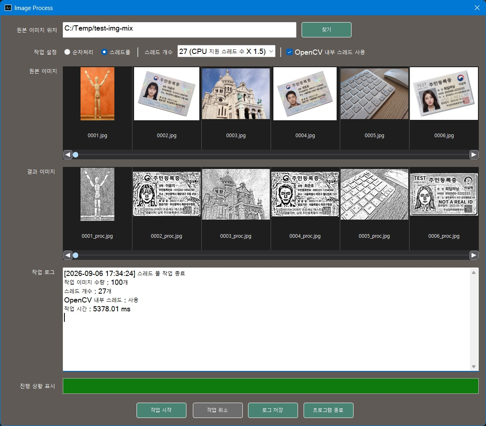

# MFC OpenCV Thread Pool Image Processing Application

<p align="center">
  
</p>

<p align="center">
  MFC 기반 영상 전처리 및 Thread Pool 병렬 처리 성능 비교 프로그램
</p>

## 프로젝트 소개

Windows MFC와 스레드 풀을 기반으로 동작하는 영상 처리 데모 프로그램입니다.

UI는 MFC를 기반으로 구성했으며, 기본 컨트롤을 상속한 커스텀 컨트롤을 적용했습니다. 고정 크기의 Thread Pool을 구현하고, 다수의 이미지 처리 작업을 Task Queue에 등록하여 Worker Thread에서 병렬로 처리하도록 구성함으로써 처리 속도를 높였습니다.

OpenCV를 이용한 이미지 처리 작업은 입력 이미지에 대해 명암 보정, 경계선 및 모서리 검출, 기울기 보정 등의 전처리를 수행하여 이미지의 가독성을 높이고 텍스트 추출에 적합한 형태로 보정합니다.

이미지 처리 작업은 UI Thread와 분리된 Worker Thread에서 수행하며, Worker Thread가 MFC UI 컨트롤에 직접 접근하지 않도록 Windows Message 기반의 구조를 사용했습니다.

이를 통해 영상 처리 중에도 UI 응답성을 유지하고 작업 시작, 진행, 완료 상태와 처리 결과를 안전하게 UI Thread에 전달할 수 있도록 구성했습니다.

처리가 완료되면 결과 영상을 화면에서 바로 확인할 수 있으며, 성능 측정을 위한 처리 시간 로그를 파일로 저장할 수 있습니다.

작업 특성과 실행 환경에 적합한 병렬화 수준을 테스트할 수 있도록 다음 조건에 따른 처리 시간을 비교하도록 구성했습니다.

- 순차 처리와 Thread Pool 기반 병렬 처리 비교
- Thread Pool Worker Thread 수에 따른 처리 성능 변화
- OpenCV 내부 스레드와 Worker Thread 간 경합에 따른 영향

---

## 주요 기능

### Image Processing

- OpenCV 기반 이미지 전처리
- CLAHE 기반 부분 영역 대비 보정
- 경계선 검출
- 모서리 검출
- 이미지 기울기 보정
- 문서 이미지 전처리 결과 확인

### Multi-thread Processing

- Thread Pool 기반 병렬 작업 처리
- Task Queue 기반 작업 등록
- Worker Thread를 통한 다중 이미지 병렬 처리
- 별도의 Single Thread 지원
- Thread Pool 실행 상태 및 종료 제어

### Performance Test

- 순차 처리와 Thread Pool 처리 시간 비교
- Worker Thread 수 변경에 따른 성능 비교
- OpenCV 내부 병렬 처리와 외부 Thread Pool 간 경합 영향 측정
- 작업별 처리 시간 로그 저장

### MFC UI

- MFC Dialog 기반 사용자 인터페이스
- 기본 컨트롤 상속을 이용한 커스텀 UI 컨트롤
- Windows Message 기반 Worker Thread / UI Thread 통신
- Worker Thread의 UI 직접 접근 방지
- 영상 처리 중 UI 응답성 유지
- 처리 결과 및 작업 시간 로그 출력

---

## 실행 파일 다운로드

별도의 빌드 과정 없이 프로그램을 실행하려면 배포 파일을 다운로드한 후 압축을 해제하십시오.

압축 해제 후 다음 실행 파일을 실행합니다.

`ImgProcAmp.exe`

실행 환경에 따라 Microsoft Visual C++ Redistributable 설치가 필요할 수 있습니다.

Microsoft Visual C++ Redistributable x64:

https://aka.ms/vc14/vc_redist.x64.exe

---

## 테스트 방법

### Thread Pool 처리 시간 비교

다수의 대용량 이미지를 이용하여 순차 처리와 Thread Pool 기반 병렬 처리의 실행 시간을 비교할 수 있습니다.

테스트 이미지는 다음 폴더에 있습니다.

`test-image/image-big`

해당 폴더의 `copy.bat` 파일을 실행하면 테스트 이미지를 복제하여 총 100장의 이미지로 구성할 수 있습니다.

다음 항목을 변경하면서 처리 시간을 비교할 수 있습니다.

- Sequential Processing
- Thread Pool Processing
- Worker Thread Count
- OpenCV Internal Thread Count

CPU의 논리 프로세서 수보다 많은 Worker Thread를 사용하거나 OpenCV 내부 스레드와 Thread Pool의 Worker Thread를 동시에 많이 사용하는 경우에는 Context Switching 및 CPU 자원 경합으로 인해 성능 향상이 제한되거나 오히려 처리 시간이 증가할 수 있습니다.

프로그램에서는 이러한 변화를 실제 처리 시간으로 확인할 수 있도록 구성했습니다.

### 영상 전처리 결과 확인

전처리 결과 확인에는 다음 폴더의 이미지를 사용할 수 있습니다.

`test-image/image-id-card`

해당 폴더에는 테스트용 가상 신분증 이미지가 포함되어 있습니다.

다음과 같은 처리 결과를 확인할 수 있습니다.

- 명암 및 대비 보정
- 경계선 검출
- 모서리 검출
- 기울기 보정
- 문서 이미지 전처리 결과

---

## Thread Pool 설계

Thread Pool은 작업 요청이 들어올 때마다 새로운 스레드를 생성하지 않고, 프로그램 시작 시 생성된 Worker Thread를 재사용하도록 구성했습니다.

작업은 Task Queue에 등록되고, 대기 중인 Worker Thread가 `std::condition_variable`을 이용하여 새로운 작업 등록을 통지받아 처리합니다.

```text
AddTask()
    │
    ▼
Task Queue
    │
    │ notify_one()
    ▼
Waiting Worker Thread
    │
    ▼
Task Execute
    │
    ▼
Result / Notification
```

이 구조를 통해 반복적인 스레드 생성 및 종료 비용을 줄이고, 다수의 영상 처리 작업을 제한된 수의 Worker Thread에서 처리할 수 있도록 했습니다.

---

## Worker Thread 구성

프로그램에서는 작업 성격에 따라 두 종류의 Worker를 사용합니다.

### Worker Thread Pool

다수의 독립적인 이미지 처리 작업을 병렬로 수행합니다.

```text
                ┌─ Worker Thread 1 ─ Image Task
Task Queue ─────┼─ Worker Thread 2 ─ Image Task
                ├─ Worker Thread 3 ─ Image Task
                └─ Worker Thread N ─ Image Task
```

### Single Thread

Thread Pool과 별도로 하나의 독립적인 작업을 실행하기 위한 Thread입니다.

Thread Pool 작업과 단일 작업을 분리하여 독립적으로 관리할 수 있도록 구성했습니다.

---

## UI Thread 연동 구조

MFC UI 컨트롤은 UI Thread에서 관리해야 하므로 Worker Thread에서 직접 컨트롤을 갱신하지 않습니다.

Worker Thread는 작업 상태와 결과를 Windows Message를 이용하여 UI Thread에 전달합니다.

```text
Worker Thread
     │
     │ PostMessage()
     ▼
Windows Message Queue
     │
     ▼
UI Thread
     │
     ▼
MFC Control Update
```

이를 통해 다음 문제를 방지하도록 구성했습니다.

- Worker Thread의 MFC UI 직접 접근
- 장시간 작업으로 인한 UI 정지
- UI Thread와 Worker Thread 간 잘못된 동시 접근

---

## 주요 처리 흐름

```text
Image Input
    │
    ▼
Preprocessing Option
    │
    ▼
Sequential / Thread Pool Selection
    │
    ▼
OpenCV Image Processing
    │
    ▼
Processing Time Measurement
    │
    ▼
Windows Message Notification
    │
    ▼
MFC UI Result Display
    │
    ▼
Log Output
```

---

## 성능 측정 목적

본 프로젝트의 Thread Pool 성능 비교는 단순히 병렬 처리가 순차 처리보다 빠르다는 것을 확인하는 것을 목적으로 하지 않습니다.

다음 요소가 실제 영상 처리 성능에 미치는 영향을 비교하는 것을 목적으로 합니다.

1. 입력 이미지의 수와 크기
2. Worker Thread 수
3. CPU 논리 프로세서 수
4. OpenCV 내부 스레드 수
5. 외부 Thread Pool과 OpenCV 내부 병렬 처리 간의 경합

특히 OpenCV 연산 중 일부는 내부적으로 멀티스레딩을 사용할 수 있기 때문에, 외부 Thread Pool의 Worker 수를 증가시키는 것만으로는 선형적인 성능 향상을 기대하기 어렵습니다.

따라서 실행 환경에 따라 적절한 Worker Thread 수와 OpenCV 내부 스레드 수를 선택하는 것이 중요하며, 프로그램에서 이를 직접 비교할 수 있도록 구성했습니다.

---

## 빌드 환경

- Windows 11 x64
- Visual Studio 2022
- C++17
- OpenCV 4.10.0

---

## 프로젝트 구성

### UI Thread

MFC 기반 화면 처리와 사용자 입력을 담당합니다.

### Worker Thread Pool

다수의 영상 처리 작업을 Task Queue에서 가져와 병렬로 처리합니다.

### Single Task Worker

Thread Pool과 별도로 단일 비동기 작업을 수행합니다.

### Task Queue

등록된 영상 처리 작업을 Worker Thread에 전달하기 위한 대기 큐입니다.

### Condition Variable

Task Queue에 새로운 작업이 등록되었을 때 대기 중인 Worker Thread를 깨우는 데 사용합니다.

### Message-based UI Notification

Worker Thread에서 발생한 작업 상태와 처리 결과를 Windows Message를 이용하여 UI Thread에 전달합니다.

---

## 사용 기술

- C++17
- Windows MFC
- OpenCV
- `std::thread`
- `std::mutex`
- `std::condition_variable`
- `std::atomic`
- `std::function`
- Windows Message
- Multi-thread / Thread Pool
- Image Processing

---

## 참고

영상 처리 성능은 입력 이미지의 크기와 개수, CPU의 물리/논리 코어 수, Thread Pool의 Worker Thread 수, OpenCV 내부 스레드 수 및 시스템 부하에 따라 달라질 수 있습니다.

동일한 설정에서도 실행 환경에 따라 측정 결과가 달라질 수 있으므로, 본 프로젝트의 성능 측정 결과는 절대적인 벤치마크가 아니라 병렬 처리 구성에 따른 상대적인 성능 변화를 비교하기 위한 용도로 사용합니다.